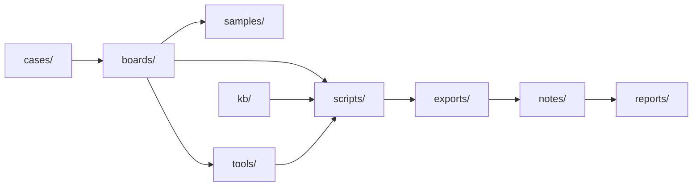

# ReverseLab AI Usage Guide

这是给 AI/Agent 的全局操作入口。任何任务先判断所属板块，再沿 board、case、tools、kb、reports 的链路推进；不要只在当前目录里孤立工作。

## 1. 任务路由

| 任务类型 | 主入口 | 工具入口 | 知识/模板 |
|---|---|---|---|
| Web / Website CTF / CVE 链 | `boards/ctf-website/README.md` | `tools/ctf-website/` | `kb/ctf-website/README.md` |
| Android / APK / DEX / Frida | `boards/android/README.md` | `tools/android/` | `templates/notes/android-apk-analysis.md` |
| Windows / PE / crackme / malware triage | `boards/windows/README.md` | `tools/windows/`, `tools/common/` | `templates/notes/windows-pe-analysis.md` |
| MCP / skills / lab health / automation | `boards/misc/README.md` | `tools/skills/README.md` | `reports/misc/`, `scripts/misc/` |
| 跨板块综合案件 | `cases/README.md` | 链接各板块 tools/scripts | `templates/cases/` |

## 2. AI 默认工作流

1. **识别板块**：Web/Android/Windows/Misc；不确定时从 `boards/README.md` 选择最接近的入口。
2. **生成任务上下文**：运行 `python scripts/misc/ai_context.py "<task>" --save`。
3. **查知识库路由**：对有明确信号的 Web 目标，运行 `python scripts/ctf-website/kb_router.py "<信号>"`。
4. **建立或更新 case**：复杂任务在 `cases/<case>/` 维护轻量索引。
5. **读取本地说明**：先看目标目录的 `README.md` / `AI-USAGE.md`。
6. **工具路由**：先运行 `python scripts/misc/ai_tool.py plan "<task>"`，再按 ID 调用工具。
7. **证据落盘**：原始输出进 `exports/<board>/`，笔记进 `notes/<board>/`，最终报告进 `reports/<board>/`。
8. **可回放**：记录关键输入、输出路径、版本和时间。

## 2.1 公共仓库边界

不要把私人工作区的 `cases/`、samples、日志、真实目标、凭据、用户目录或个人信息
迁入本仓库。通用发现应去标识化后写入 `kb/`；发布前运行
`python scripts/misc/public_release_check.py`。详细规则见 `PUBLICATION.md`。

## 3. 跨板块联动规则



- Web CTF 发现版本指纹后，联动 CVE 查找和图谱生成。
- Android/Windows 发现加密、壳、混淆后，脚本复现放 `scripts/<area>/`，解包产物放 `samples/unpacked/`。
- 恶意/高风险样本先放隔离目录；分析目标是行为、IOC、检测规则和复现证据。
- exploitdb、payload、PoC 类文件可能触发杀软；默认保存在 lab 目录，记录来源和用途。

## 4. 完成标准

一个任务不能只说"应该可以"，必须有当前状态证据：

- 文件存在：绝对路径。
- 工具可用：版本输出或 toolcheck 报告。
- 分析结论：对应样本 hash、地址、字符串、请求/响应、日志或截图。
- 漏洞/CVE：指纹证据、CVE 数据、EPSS/KEV、利用链假设和验证结果。
- 交付物：`reports/<area>/` 或 `cases/<case>/` 中可复查。

## 5. 常用自检

```powershell
python scripts/misc/lab_healthcheck.py
python scripts/misc/ai_toolcheck.py
```
