# Web 攻击网

线性攻击链不够。攻击网 = 多入口、多分叉、跨分类交织的图结构。每个节点是一个 Primitive，每条边是一个攻击步骤。

## 全网图 (Mermaid)

```mermaid
graph TD
    %% === Layer 0: Entry Points ===
    XSS["XSS<br/>07-client"]
    SSRF["SSRF<br/>04-ssrf"]
    SQLI["SQLi<br/>03-injection"]
    LFI["LFI<br/>06-file"]
    UPLOAD["File Upload<br/>06-file"]
    DESER["Deserialize<br/>05-deser"]
    PP["Proto Pollution<br/>03-injection"]
    HOST["Host Header<br/>02-auth"]
    OAUTH["OAuth<br/>02-auth"]
    OPENREDIR["Open Redirect<br/>04-ssrf"]
    GRAPHQL["GraphQL<br/>03-injection"]
    WEBSOCKET["WebSocket<br/>07-client"]
    CORS["CORS<br/>07-client"]
    CRLF["CRLF/HPP<br/>03-injection"]
    DEPCONF["Dep Confusion<br/>11-supply"]
    GHA["GitHub Actions<br/>10-cloud"]
    LAMBDA["Lambda<br/>10-cloud"]
    POD["K8s Pod<br/>10-cloud"]
    SAML["SAML<br/>02-auth"]
    REDOS["ReDoS<br/>03-injection"]
    PAYBY["Payment Bypass<br/>12-payment"]
    PRICE["Price Manip<br/>12-payment"]
    CALLBACK["Callback Forge<br/>12-payment"]
    SIGALG["Sign Alg Attack<br/>13-signature"]
    SIGIMPL["Sign Impl Bug<br/>13-signature"]
    SIGKEY["Sign Key Leak<br/>13-signature"]

    %% === Layer 1: Credential / Info Leak ===
    CRED["Credential Leak<br/>session/token/key"]
    SRC["Source Leak<br/>config backup env"]
    IAM["IAM Credential<br/>AWS role token"]
    SATOKEN["SA Token<br/>K8s service account"]
    DB["Database Access<br/>read/write rows"]

    %% === Layer 2: Auth Bypass / Privilege ===
    ADMIN["Admin Access<br/>后台/管理面板"]
    BE["Backend RCE<br/>shell execution"]

    %% === Layer 3: Data / Flag ===
    FLAG["🏴 Flag"]

    %% --- Edges: Entry → Credential ---
    XSS -->|cookie steal| CRED
    XSS -->|localStorage| CRED
    XSS -->|CSRF token read| CRED
    SSRF -->|metadata| IAM
    SSRF -->|metadata| CRED
    SSRF -->|internal config| SRC
    LFI -->|config.php/.env| SRC
    LFI -->|/proc/self/environ| CRED
    LFI -->|shadow| CRED
    SQLI -->|user table| CRED
    SQLI -->|INFORMATION_SCHEMA| DB
    SQLI -->|LOAD_FILE| SRC
    HOST -->|reset email hijack| CRED
    OAUTH -->|redirect steal| CRED
    OAUTH -->|client secret| SRC
    CORS -->|cross-origin read| CRED
    CORS -->|ACAO:*+creds| CRED
    OPENREDIR -->|OAuth code steal| CRED
    POSTMESSAGE["PostMessage<br/>07-client"]
    POSTMESSAGE -->|token leak| CRED
    DEPCONF -->|CI env steal| CRED
    DEPCONF -->|~/.aws/creds| IAM
    GHA -->|workflow injection| CRED
    GHA -->|GITHUB_TOKEN| SRC
    LAMBDA -->|env vars| IAM
    POD -->|SA token mount| SATOKEN
    POD -->|kubelet| SATOKEN
    POD -->|etcd| SRC
    SAML -->|NameID forge| CRED
    SAML -->|attribute inject| ADMIN
    REDOS -->|auth bypass| ADMIN
    REDOS -->|WAF bypass| BE
    WEBSOCKET -->|CSWSH| CRED

    %% --- Edges: Payment → Direct Flag ---
    PAYBY -->|zero amount| FLAG
    PAYBY -->|state bypass| FLAG
    PAYBY -->|mass assignment| FLAG
    PRICE -->|type confusion| FLAG
    PRICE -->|precision attack| FLAG
    PRICE -->|currency exploit| FLAG
    CALLBACK -->|signature forge| FLAG
    CALLBACK -->|idempotency race| FLAG
    CALLBACK -->|replay attack| FLAG
    %% --- Edges: Payment → Credential/Admin ---
    PAYBY -->|coupon steal| CRED
    CALLBACK -->|webhook SSRF| IAM
    CALLBACK -->|notify_url SSRF| SRC
    CALLBACK -->|internal notify| ADMIN
    PRICE -->|coupon abuse| CRED

    %% --- Edges: Signature → Everything ---
    SIGALG -->|alg downgrade| CALLBACK
    SIGALG -->|none alg| JWT
    SIGIMPL -->|strcmp bypass| CALLBACK
    SIGIMPL -->|type juggling| PAYBY
    SIGKEY -->|JMK leak| JWT
    SIGKEY -->|secret leak| CALLBACK
    SIGKEY -->|.env leak| SRC

    %% --- Edges: Info → Admin ---
    CRED -->|session reuse| ADMIN
    CRED -->|JWT forge| ADMIN
    CRED -->|API key| ADMIN
    SRC -->|hardcoded password| ADMIN
    SRC -->|DB password| DB
    SRC -->|encryption key| CRED
    IAM -->|AWS CLI| ADMIN
    IAM -->|sts:AssumeRole| ADMIN
    SATOKEN -->|kubectl| ADMIN
    DB -->|admin hash crack| ADMIN

    %% --- Edges: Admin → RCE ---
    ADMIN -->|upload webshell| BE
    ADMIN -->|template edit| BE
    ADMIN -->|plugin install| BE
    SSRF -->|Gopher Redis| BE
    SSRF -->|Docker API| BE
    SSRF -->|FastCGI| BE
    DESER -->|gadget chain| BE
    PP -->|child_process| BE
    PP -->|EJS/Pug| BE
    SSTI["SSTI<br/>03-injection"]
    SSTI -->|subprocess| BE
    GRAPHQL -->|SQLi via arg| BE
    CRLF -->|Redis injection| BE
    LAMBDA -->|Runtime API| BE
    POD -->|runc escape| BE
    POD -->|privileged pod| BE

    %% --- Edges: RCE → Flag ---
    BE -->|cat /flag| FLAG
    BE -->|read env| FLAG
    DB -->|SELECT flag| FLAG
    SRC -->|flag in config| FLAG
    IAM -->|aws s3 cp| FLAG
    SATOKEN -->|kubectl exec cat| FLAG

    %% --- Cross-category edges ---
    XSS -.->|admin bot| SSRF
    XSS -.->|admin bot| BE
    OPENREDIR -.->|chain to| SSRF
    CRLF -.->|smuggling| SSRF
    LFI -.->|log poison| BE
    UPLOAD -.->|xxe| SSRF
    UPLOAD -.->|php shell| BE
    SQLI -.->|stacked| UPLOAD
    SQLI -.->|dblink| SSRF
    CORS -.->|token read| XSS
    WEBSOCKET -.->|message inject| SQLI
    GRAPHQL -.->|field suggest| SQLI
    REDOS -.->|event loop block| ADMIN
    HOST -.->|header inject| CRLF
    SAML -.->|XSW bypass| ADMIN
```



## 典型攻击网路径

### 路径 1: 从 XSS 到 Flag (Client→Credentials→Flag)
```
XSS → cookie steal → Session hijack → Admin panel → Template edit → RCE → Flag
  ├─ alt: XSS → CSRF token read → POST /admin/createUser → Backdoor admin
  ├─ alt: XSS → localStorage → JWT → forge claims → API abuse → Data exfil
  └─ alt: XSS → admin bot → SSRF → metadata → IAM → aws s3 → Flag
```

### 路径 2: 从 SSRF 到 Flag (Network→Metadata→Cloud→Flag)
```
SSRF → 169.254.169.254 → IAM credential → AWS CLI
  ├─ → s3:ListBuckets → s3:GetObject → Flag
  ├─ → lambda:UpdateFunctionCode → Backdoor Lambda → steal events
  └─ → sts:AssumeRole → cross-account → more resources
```

### 路径 3: 从 SQLi 到 Flag (Injection→Credentials→RCE→Flag)
```
SQLi → users table → admin hash → crack → login
  ├─ → upload webshell → RCE → Flag
  ├─ → template edit → SSTI → Flag
  └─ → SQLi → LOAD_FILE('/flag') → Flag (direct)
```

### 路径 4: 从 LFI 到 Flag (File Read→Config→DB→Flag)
```
LFI → /var/www/.env → DB_PASSWORD → mysql connect
  ├─ → SELECT flag FROM flags → Flag
  ├─ → LFI → /proc/self/environ → API_KEY → API abuse → Flag
  └─ → LFI → log poison → RCE → Flag
```

### 路径 5: 从 CI/CD 到 Flag (Supply→Credentials→Cloud→Flag)
```
GitHub Actions injection → GITHUB_TOKEN → push to main
  ├─ → deploy pipeline → AWS creds → s3 → Flag
  ├─ → npm publish malicious version → downstream → all customers
  └─ → self-hosted runner → metadata → IAM → everything
```

### 路径 6: K8s Pod→Cloud
```
Pod RCE → /var/run/secrets/kubernetes.io/serviceaccount/token
  ├─ → RBAC create privileged pod → hostPath / → node RCE → metadata → IAM
  ├─ → kubelet:10250 → exec in other pods → steal their SA tokens
  └─ → etcd:2379 → read all secrets → DB passwords → Flag
```

## 攻击网中的关键枢纽节点

这些节点被最多其他节点依赖，是攻击网中的 choke point：

| 节点 | 入度 | 出度 | 说明 |
|------|------|------|------|
| `Credential Leak` | 12 | 3 | 几乎所有攻击面都可以泄露凭证 |
| `Admin Access` | 8 | 3 | 提权到管理员的必经之路 |
| `Backend RCE` | 11 | 1 | 最终执行的关键节点 |
| `Source Leak` | 7 | 3 | 配置/源码泄露 → DB密码/密钥 |
| `SSRF` | 5 | 4 | 从外网打到内网的核心桥梁 |

## 网中没画但存在的边 (隐性连接)

```
Timing Attack → HMAC key → JWT → Admin API
  (timing 逐字节恢复 → JWT forge → 管理接口)

Dependency Confusion → CI build → .env → DB → SELECT flag
  (供应链入口 → CI环境 → 配置窃取 → 数据库 → flag)

ReDoS → Node.js block → Auth bypass → Admin → Flag
  (正则回溯卡住线程 → 认证请求不处理 → 未认证请求通过)

PostMessage → OAuth token → Account takeover → Flag
  (跨域消息 → 窃取token → 接管账号 → flag)

Web Cache Deception → /account.json → cached PII → Flag
  (缓存欺骗 → 敏感数据缓存 → 无认证读取)

Cache Poisoning → JS hijack → XSS → Cookie steal → Flag
  (unkeyed header → 缓存恶意JS → 全站XSS → 凭证窃取)
```

## 攻击网驱动决策

```
拿到 target 后:
1. 指纹 → 确认技术栈
2. 查攻击网 → 哪些 Entry 适合这个技术栈?
3. 对每个可用 Entry → 看它指向哪些 Credential/Info 节点
4. 从 Credential → 看通向 Admin/RCE 的路径
5. 从 RCE → 直接 Flag 或再收敛

不要线性思考 "A→B→C→Flag"
而要网状思考 "从 A 可以到 B C D，B 可以到 E F，C 可以到 G H..."
选最短路径，同时备份备选路径。
```
